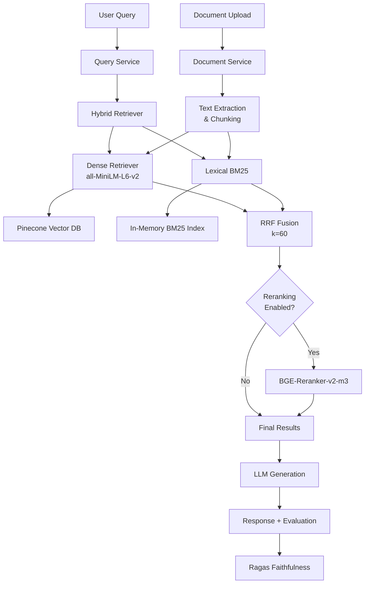
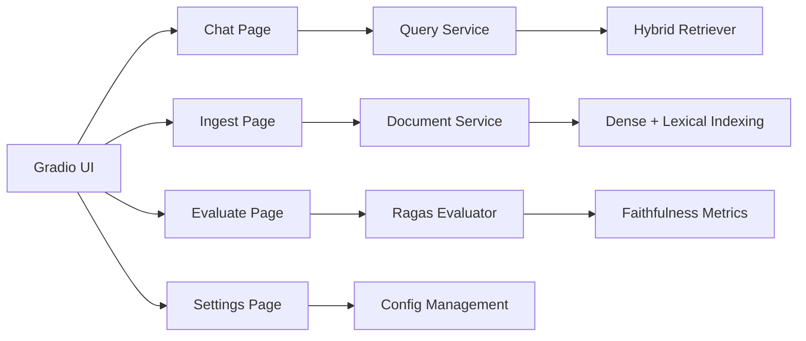

# Personal RAG Copilot

A hybrid retrieval-augmented generation platform combining dense vector search and lexical BM25 search with advanced ranking fusion capabilities.

[](LICENSE)

## Quick Reference

### Key Features

- **Hybrid Search**: Dense vector retrieval (all-MiniLM-L6-v2) + lexical BM25 with Reciprocal Rank Fusion [[EVID: src/retrieval/hybrid.py:1-47 | HybridRetriever orchestrates both methods]]
- **Advanced Ranking**: RRF fusion with k=60 default and optional BGE-Reranker-v2-m3 cross-encoder [[EVID: src/ranking/rrf_fusion.py:8-9 | DEFAULT_RRF_K = 60]]
- **Quality Evaluation**: Ragas faithfulness assessment with automatic scoring [[EVID: src/evaluation/ragas_integration.py:33-65 | RagasEvaluator with faithfulness metric]]
- **Multipage Interface**: Gradio 5 application with Chat, Ingest, Evaluate, and Settings pages [[EVID: app.py:8-12 | FastAPI with Gradio mounting]]
- **Document Processing**: Multi-format ingestion (PDF, DOCX, TXT, MD, HTML) with intelligent chunking [[EVID: src/services/document_service.py:22-75 | DocumentService with format support]]
- **Transparency**: Retrieval audit trails with component scores and source attribution [[EVID: src/ranking/rrf_fusion.py:56-61 | metadata with fusion_method and component_scores]]

### Tech Stack

- **Backend**: Python 3.8+, FastAPI, Gradio 5
- **ML/AI**: Sentence-Transformers, HuggingFace Transformers, Ragas
- **Search**: Pinecone (vector), rank-bm25 (lexical)
- **Testing**: pytest, pytest-asyncio, pytest-cov

## Architecture Overview



The system implements a hybrid retrieval architecture where queries are processed by both dense vector search (384-dimensional embeddings) and lexical BM25 search in parallel, then combined using Reciprocal Rank Fusion.



The user interface provides four main workflows: querying the knowledge base, ingesting documents, evaluating response quality, and configuring system parameters.

## Installation

### Prerequisites

- Python 3.8+ [[EVID: requirements.txt:1-48 | Python dependencies specified]]
- Pinecone API account and API key
- 8GB+ RAM for model loading

### Setup

1. **Clone and install dependencies**:
```bash
git clone <repository-url>
cd personal-rag-copilot
pip install pip-tools
pip-sync requirements.txt
```

2. **Configure environment**:
```bash
export PINECONE_API_KEY="your-api-key"
export PINECONE_ENVIRONMENT="your-environment"
```

3. **Verify installation**:
```bash
python app.py
# Server should start on http://0.0.0.0:7860
```

## Usage

### Quickstart

1. **Start the application**:
```bash
python app.py
```

2. **Access the interface** at `http://localhost:7860`

3. **Upload documents** via the Ingest tab (supports PDF, DOCX, TXT, MD, HTML)

4. **Query your documents** through the Chat interface with streaming responses

5. **Evaluate quality** using the Evaluate tab for faithfulness scoring

### Configuration

Key parameters can be configured via YAML files:

| Parameter | Default | Description |
|-----------|---------|-------------|
| `top_k` | 5 | Number of results to retrieve [[EVID: config/default_settings.yaml:1-2 | top_k: 5]] |
| `rrf_k` | 60 | RRF fusion parameter [[EVID: config/default_settings.yaml:1-2 | rrf_k: 60]] |

### API Usage

The system exposes RESTful endpoints via FastAPI:

```python
# Query endpoint
POST /api/v1/query
{
    "query": "your question",
    "mode": "hybrid",  # or "dense", "lexical"
    "top_k": 5
}
```

## Project Structure

```
personal-rag-copilot/
├── src/                          # Main source code
│   ├── retrieval/               # Hybrid search implementation
│   ├── ranking/                 # RRF fusion and reranking
│   ├── ui/                      # Gradio interface pages  
│   ├── evaluation/              # Ragas quality assessment
│   ├── integrations/            # External service clients
│   ├── services/                # Business logic layer
│   └── config/                  # Configuration management
├── tests/                       # Test suite with pytest
├── config/                      # YAML configuration files
├── app.py                       # FastAPI + Gradio entry point
└── requirements.txt             # Python dependencies
```

## Development Guide

### Environment Setup

```bash
# Install development dependencies
pip install pip-tools
pip-sync requirements.txt

# Run tests with coverage
python -m pytest tests/ --cov=src --cov-report=html

# Code formatting and linting
black src/ tests/ app.py
flake8 src/ tests/ app.py
mypy src/ app.py
```

### Testing

Run specific test suites:

```bash
# Test retrieval engine
python -m pytest tests/test_retrieval/ -v

# Test RRF fusion
python -m pytest tests/test_ranking/test_rrf.py -v

# Test Pinecone integration  
python -m pytest tests/test_integrations/test_pinecone.py -v
```

### Performance Validation

```bash
# Benchmark retrieval performance
python scripts/benchmark_retrieval.py

# Validate RRF implementation
python scripts/validate_rrf.py
```

## Additional Documentation

- [Product Requirements](PRD.md) - Feature specifications and acceptance criteria
- [Functional Requirements](FRD.md) - Detailed technical requirements  
- [Architecture Guide](project_architecture_diagram.md) - System design overview
- [Development Guidelines](AGENTS.md) - Coding standards and contribution guide

## Troubleshooting

### Common Issues

- **Pinecone Connection**: Ensure `PINECONE_API_KEY` and `PINECONE_ENVIRONMENT` are set
- **Model Loading**: First run downloads models to `~/.cache/huggingface/` (requires internet)
- **Memory Usage**: System requires 8GB+ RAM for full model loading [[EVID: AGENTS.md:278-280 | Memory usage MUST remain under 8GB]]

---

*Generated on 2025-01-27T21:45:00Z*

<details>
<summary>Evidence Appendix</summary>

- [[EVID: src/retrieval/hybrid.py:1-47 | HybridRetriever class orchestrates dense and lexical retrievers with per-query modes]]
- [[EVID: src/ranking/rrf_fusion.py:8-9 | DEFAULT_RRF_K = 60 constant defines default fusion parameter]]
- [[EVID: src/evaluation/ragas_integration.py:33-65 | RagasEvaluator class implements faithfulness assessment using Ragas framework]]
- [[EVID: app.py:8-12 | FastAPI application with Gradio routes mounted for multipage interface]]
- [[EVID: src/services/document_service.py:22-75 | DocumentService.parse_document supports multiple formats including PDF, DOCX, TXT, MD, HTML]]
- [[EVID: src/ranking/rrf_fusion.py:56-61 | metadata includes fusion_method, rrf_weights, and component_scores for transparency]]
- [[EVID: requirements.txt:1-48 | Python dependencies specification including core frameworks and ML libraries]]
- [[EVID: config/default_settings.yaml:1-2 | Default configuration with top_k: 5 and rrf_k: 60]]
- [[EVID: AGENTS.md:278-280 | Performance requirement stating memory usage MUST remain under 8GB for full system operation]]

</details>
